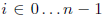

Assignment: Knapsack Problem
=====================

Problem Statement
-----------------
In this assignment you will design an algorithm to solve the infamous Knapsack Problem, which
plagues Indiana Jones. You are provided with a knapsack with limited space and a collection of
items with different values and weights. Your task is to maximize the value of items packed into
your knapsack without exceeding its total capacity.

Assignment
----------------
Write an algorithm to solve the knapsack problem. The problem is mathematically formulated in
the following way. Given n items to choose from, each item  has a value vi and a
weight wi. The knapsack has a limited capacity K. Let xi be a variable that is 1 if you choose
to take item i and 0 if you leave item i behind. Then the knapsack problem is formalized as the
following optimization problem,

