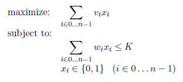

Assignment: Knapsack Problem
=====================

In this assignment you will design an algorithm to solve the infamous Knapsack Problem, which
plagues Indiana Jones. You are provided with a knapsack with limited space and a collection of
items with different values and weights. Your task is to maximize the value of items packed into
your knapsack without exceeding its total capacity.


Assignment
----------------
Write an algorithm to solve the knapsack problem. The problem is mathematically formulated in
the following way. Given n items to choose from, each item  has a value vi and a
weight wi. The knapsack has a limited capacity K. Let xi be a variable that is 1 if you choose
to take item i and 0 if you leave item i behind. Then the knapsack problem is formalized as the
following optimization problem:



Data Format Specification
-------------------------
A knapsack input contains n + 1 lines. The first line contains two integers, the first is the number
of items in the problem, n. The second number is the capacity of the knapsack, K. The remaining
lines present the data for each of the items. Each line,  contains two integers, the
item's value vi followed by its weight wi.

<b>Input Format</b>
```
n K
v_0 w_0
v_1 w_1
...
v_n-1 w_n-1
```

The output contains a knapsack solution and is made of two lines. The first line contains two values
obj and opt. obj is the total value of the items selected to go into the knapsack (i.e. the objective
value). opt should be 1 if your algorithm proved optimality and 0 otherwise. The next line is a list
of n 0/1-values, one for each of the xi variables. This line encodes the solution.

<b>Output Format</b>
```
obj opt
x_0 x_1 x_2 ... x_n-1
```
